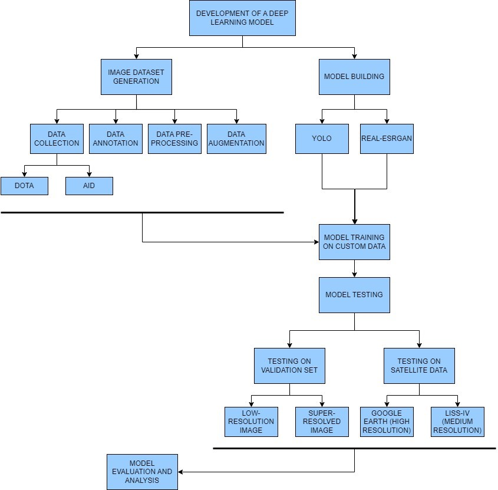

# Object-Detection-from-Satellite-Images
We use YOLOv8 on satellite images to detect aircrafts from the same. Below given is a flowchart to better understand the flow in which things were done.

Apart from performing object detection, another important aspect of this work is to sort of do a hit-and-trial to see the impact of using super-resolved images. A slight improvement in detection was observed.
Super-resolution was performed using [Real-ESRGAN](https://github.com/xinntao/Real-ESRGAN).
